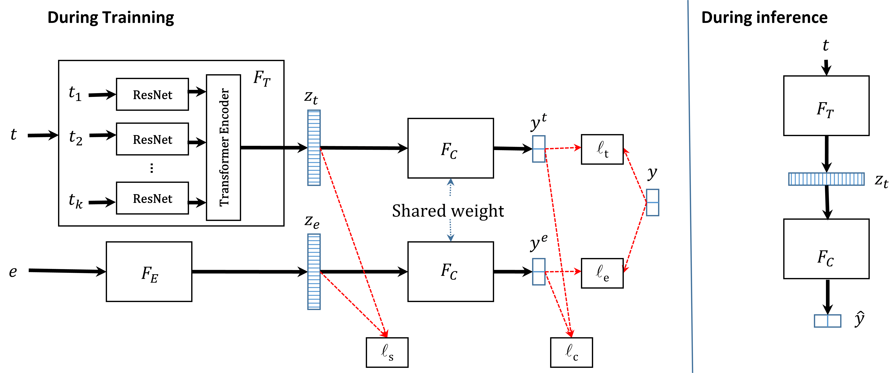
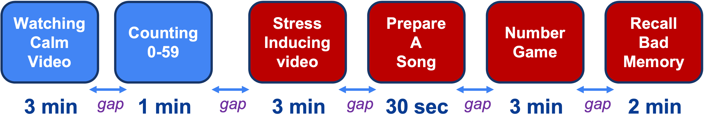

# ThermaStrain

This is the official implementation of paper ["Reading Between the Heat: Co-Teaching Body Thermal Signatures for Non-intrusive Stress Detection"](https://dl.acm.org/doi/10.1145/3631441). Accepted by IMWUT / UbiComp 2024.

In this paper, we propose ThermaStrain, a novel co-teaching framework that achieves high-stress prediction performance by transferring knowledge from the wearable modality to the contactless thermal modality.

During training, ThermaStrain incorporates a wearable electrodermal activity (EDA) sensor to generate stress-indicative representations from thermal videos, emulating stress-indicative representations from a wearable EDA sensor. During testing, only thermal sensing is used, and stress-indicative patterns from thermal data and emulated EDA representations are extracted to improve stress assessment. 

  

To evaluate our model, we collected a comprehensive dataset with thermal video and EDA data under various stress conditions and distances. The study protocol is illustrated in the figure below. On average, each data collection session lasted around 15 minutes, including the gaps between tasks.

  

For your convenience, the preprocessed data is provided [here]().

If you find this work useful, please consider to cite as follows:

      @article{xiao2024reading,
        title={Reading between the heat: Co-teaching body thermal signatures for non-intrusive stress detection},
        author={Xiao, Yi and Sharma, Harshit and Zhang, Zhongyang and Bergen-Cico, Dessa and Rahman, Tauhidur and Salekin, Asif},
        journal={Proceedings of the ACM on Interactive, Mobile, Wearable and Ubiquitous Technologies},
        volume={7},
        number={4},
        pages={1--30},
        year={2024},
        publisher={ACM New York, NY, USA}
      }
